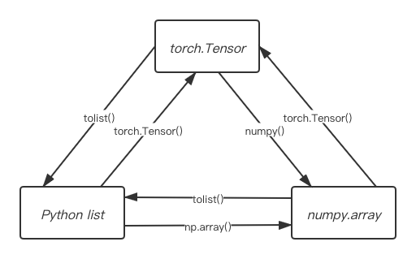

# Data Preparation
0. [Preface](#preface)
1. [Tensor](#tensor)
## 0. Preface
This note indecates some basic operation with data preparation using PyTorch. The purpose of this note is to summarize the usage of PyTorch and its Tensor.  
To figure out the difference between _numpy.array_ and _torch.Tensor_, and Python _list_ of course will be the first step. Then, some examples will be presented to help remembering basic operations and to reduce the preparing time later.
## 1. Tensor
_torch.Tensor_ is similar to _numpy.array_。Main difference is that it's able to get a tensor in GPU using _torch.Tensor.cuda(device)_ or _torch.Tensor.to(device)_, but _numpy.array_ isn't. Both can _*.tolist()_ to transfer to a Python _list_. **Figure 1-1** shows the relationship among them.
